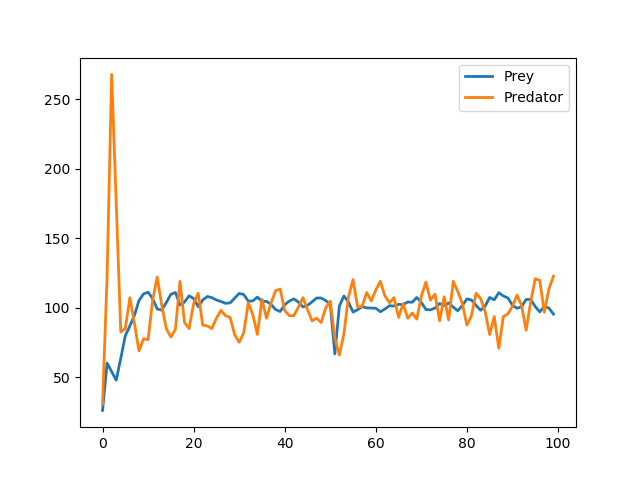
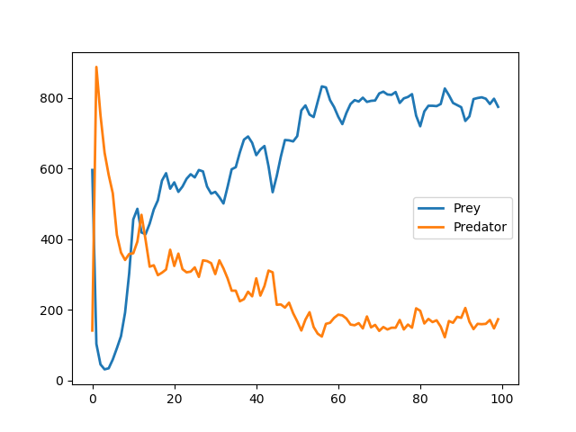

# wator
A simpler implemenation of the ["Wa-Tor simulation"](https://en.wikipedia.org/wiki/Wa-Tor)  

Requires Python 2 and optionally for plotting [matplotlib](https://pypi.org/project/matplotlib/).  
Tested on Windows XP  

  

  

  

